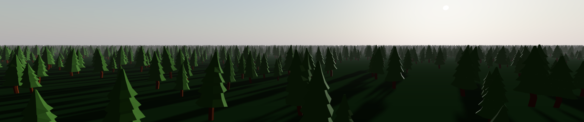

<div align="center">
  
  <h1>Three.ez - InstancedMesh2</h1>
  <p>
    <em>Simplify your <b>three.js</b> application development with <b>three.ez</b>!</em>
  </p>

   <br>

  [](https://discord.gg/MVTwrdX3JM)
  [](https://www.npmjs.com/package/@three.ez/instanced-mesh)
  [](https://github.com/three-ez/instanced-mesh)
  [](https://bundlephobia.com/package/@three.ez/instanced-mesh)
  [](https://sonarcloud.io/summary/new_code?id=agargaro_instanced-mesh)
  [](https://deepscan.io/dashboard#view=project&tid=21196&pid=27990&bid=896898)

</div>

`InstancedMesh2` is an alternative version of `InstancedMesh` with enhanced features for performance and usability.

```ts
const myInstancedMesh = new InstancedMesh2(geometry, material);

myInstancedMesh.addInstances(count, (obj, index) => {
  obj.position.x = index;
});
```

- [**Dynamic capacity**](#dynamic-capacity): *add or remove instances seamlessly.*
- [**Object3D-like instances**](#object3d-like-instances): *use instances like `Object3D` with transforms and custom data.*
- [**Per-instance frustum culling**](#per-instance-frustum-culling): *skip rendering for out-of-view instances.*
- [**Spatial indexing (dynamic BVH)**](#spatial-indexing-dynamic-bvh): *speed up raycasting and frustum culling.*
- [**Sorting**](#sorting): *reduce overdraw and manage transparent objects efficiently.*
- [**Per-instance visibility**](#per-instance-visibility): *toggle visibility for each instance individually.*
- [**Per-instance opacity**](#per-instance-opacity): *set opacity for each instance individually.*
- [**Per-instance uniforms**](#per-instance-uniforms): *assign unique shader data to individual instances.*
- [**Level of Detail (LOD)**](#level-of-detail-lod): *dynamically adjust instance detail based on distance.*
- [**Shadow LOD**](#shadow-lod): *optimize shadow rendering with lower detail for distant instances.*
- [**Skinning**](#skinning): *apply skeletal animations to instances for more complex and dynamic movements.*

## 🧑‍💻 Live Examples

**Vanilla**
-  [Dynamic adding with BVH](https://stackblitz.com/edit/stackblitz-starters-au96fmqz?file=index.html) (thanks to [Saumac](https://github.com/saumac))

**Using three.ez/main**
-  [1kk static trees](https://stackblitz.com/edit/three-ezinstancedmesh2-1kk-static-trees?file=src%2Fmain.ts&embed=1&hideDevTools=1&view=preview)
-  [Instances array dynamic](https://stackblitz.com/edit/three-ezinstancedmesh2-instances-array-dynamic?file=src%2Fmain.ts&embed=1&hideDevTools=1&view=preview)
-  [Sorting](https://stackblitz.com/edit/three-ezinstancedmesh2-sorting?file=src%2Fmain.ts&embed=1&hideDevTools=1&view=preview)
-  [Uniforms per instance](https://stackblitz.com/edit/three-ezinstancedmesh2-custom-material?file=src%2Fmain.ts&embed=1&hideDevTools=1&view=preview)
-  [Dynamic BVH (no vite)](https://stackblitz.com/edit/three-ezinstancedmesh2-dynamic-bvh?file=index.ts&embed=1&hideDevTools=1&view=preview)
-  [Fast raycasting](https://stackblitz.com/edit/three-ezinstancedmesh2-fast-raycasting?file=src%2Fmain.ts&embed=1&hideDevTools=1&view=preview)
-  [LOD](https://stackblitz.com/edit/three-ezinstancedmesh2-instancedmeshlod?file=src%2Fmain.ts&embed=1&hideDevTools=1&view=preview)
-  [Shadow LOD](https://stackblitz.com/edit/three-ezinstancedmesh2-shadow-lod?file=src%2Fmain.ts&embed=1&hideDevTools=1&view=preview)
-  [Skinning 3k instances](https://stackblitz.com/edit/three-ezinstancedmesh2-skinning?file=src%2Fmain.ts&embed=1&hideDevTools=1&view=preview)
-  [Dynamic adding with BVH](https://glitch.com/edit/#!/three-ez-instanced-mesh-dynamic-adding-with-bvh?path=main.js)
-  [Skinning](https://glitch.com/edit/#!/instancedmesh2-skinning?path=main.js)

**Using other libraries**
- Threlte
-  [React-three-fiber](https://stackblitz.com/edit/vitejs-vite-zahmbaan?file=src%2FApp.tsx) (thanks to [Saumac](https://github.com/saumac))
-  [React-three-fiber](https://stackblitz.com/~/github.com/Lunakepio/ac-2-dna-ui) (thanks to [Lunakepio](https://github.com/Lunakepio))

## ❔ Need help?

Join us on [Discord](https://discord.gg/MVTwrdX3JM) or open an issue on GitHub.

## ⭐ Like it?

If you like this project, please leave a star. Thank you! ❤️

## 📚 Documentation

The documentation is available [here](https://agargaro.github.io/instanced-mesh).

## ⬇️ Installation

You can install it via npm using the following command:

```bash
npm install @three.ez/instanced-mesh
```

Or you can import it from CDN:

```html
<script type="importmap">
{
  "imports": {
    "three": "https://cdn.jsdelivr.net/npm/three/build/three.module.js",
    "three/addons/": "https://cdn.jsdelivr.net/npm/three/examples/jsm/",
    "@three.ez/instanced-mesh": "https://cdn.jsdelivr.net/npm/@three.ez/instanced-mesh/build/index.js",
    "bvh.js": "https://cdn.jsdelivr.net/npm/bvh.js/build/index.js"
  }
}
</script>
```

## 🚀 Features

### Dynamic capacity

Manage a dynamic number of instances, automatically expanding the data buffers as needed to accommodate additional instances. <br>

If not specified, `capacity` is `1000`. <br>

```ts
const myInstancedMesh = new InstancedMesh2(geometry, material, { capacity: count }); 

myInstancedMesh.addInstances(count, (obj, index) => { ... }); // add instances and expand buffer if necessary

myInstancedMesh.removeInstances(id0, id1, ...);

myInstancedMesh.clearInstances(); // remove all instances
```

### Object3D-like instances

It's possible to create an array of `InstancedEntity` **(Object3D-like)** in order to easily manipulate instances, using more memory.

```ts
const myInstancedMesh = new InstancedMesh2(geometry, material, { createEntities: true });

myInstancedMesh.instances[0].customData = {};
myInstancedMesh.instances[0].position.random();
myInstancedMesh.instances[0].rotateX(Math.PI);
myInstancedMesh.instances[0].updateMatrix(); // necessary after transformations
```  

### Per-instance frustum culling

Avoiding rendering objects outside the camera frustum can drastically improve performance (especially for complex geometries). <br>
Frustum culling by default is performed by iterating all instances, [but it is possible to speed up this process by creating a spatial indexing data structure **(BVH)**](#spatial-indexing-dynamic-bvh). <br>

By default `perObjectFrustumCulled` is `true`.

### Spatial indexing (dynamic BVH)

**To speed up raycasting and frustum culling**, a spatial indexing data structure can be created to contain the boundingBoxes of all instances. <br>
This works very well if the instances are **mostly static** (updating a BVH can be expensive) and scattered in world space. <br>
Setting a margin makes BVH updating faster, but may make raycasting and frustum culling slightly slower.
```ts
myInstancedMesh.computeBVH({ margin: 0 });
```

### Sorting

Sorting can be used to decrease overdraw and render transparent objects. <br>

It's possible to improve sort performance adding a `customSort`, like built-in `createRadixSort`.

By default `sortObjects` is `false`. <br>

```ts
import { createRadixSort } from '@three.ez/instanced-mesh';

myInstancedMesh.sortObjects = true;
myInstancedMesh.customSort = createRadixSort(myInstancedMesh);
```

### Per-instance visibility

Set the visibility status of each instance.

```ts
myInstancedMesh.setVisibilityAt(index, false);
myInstancedMesh.instances[0].visible = false; // if instances array is created
```

### Per-instance opacity

Set the opacity of each instance. It's recommended to enable [**instances sorting**](#sorting) and disable the `depthWriting` of the material.

```ts
myInstancedMesh.setOpacityAt(index, 0.5);
myInstancedMesh.instances[0].opacity = 0.5; // if instances array is created
```   

### Per-instance uniforms

Assign unique shader uniforms to each instance, working with every materials.

```ts
myInstancedMesh.initUniformsPerInstance({ fragment: { metalness: 'float', roughness: 'float', emissive: 'vec3' } });

myInstancedMesh.setUniformAt(index, 'metalness', 0.5);
myInstancedMesh.instances[0].setUniform('emissive', new Color('white')); // if instances array is created
```

### Level of Detail (LOD)

Improve rendering performance by dynamically adjusting the detail level of instances based on their distance from the camera. <br>
Use simplified geometries for distant objects to optimize resources.

```ts
myInstancedMesh.addLOD(geometryMid, material, 50);
myInstancedMesh.addLOD(geometryLow, material, 200);
```     

### Shadow LOD

Optimize shadow rendering by reducing the detail level of instances casting shadows based on their distance from the camera.

```ts
myInstancedMesh.addShadowLOD(geometryMid);
myInstancedMesh.addShadowLOD(geometryLow, 100);
```    

### Skinning

Apply skeletal animations to instances for more complex and dynamic movements.

```ts
myInstancedMesh.initSkeleton(skeleton);

mixer.update(time);
myInstancedMesh.setBonesAt(index);
```   

### Raycasting tips

If you are not using a BVH, you can set the `raycastOnlyFrustum` property to **true** to avoid iterating over all instances.

It's recommended to use [three-mesh-bvh](https://github.com/gkjohnson/three-mesh-bvh) to create a geometry BVH.

## 🤝 Special thanks to

- [gkjohnson](https://github.com/gkjohnson)
- [manthrax](https://github.com/manthrax)
- [jungle_hacker](https://github.com/lambocorp)

## 📖 References

- [three-mesh-bvh](https://github.com/gkjohnson/three-mesh-bvh)
- [ErinCatto_DynamicBVH](https://box2d.org/files/ErinCatto_DynamicBVH_Full.pdf)
